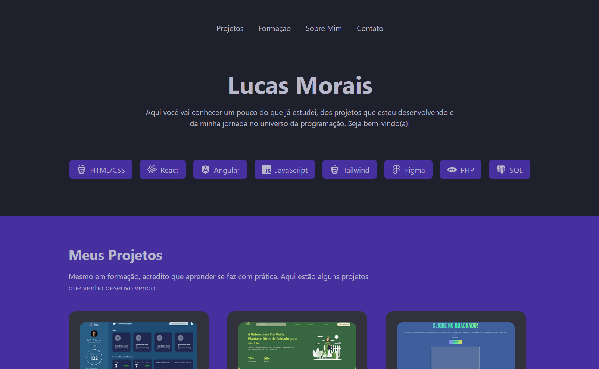

# Portfólio Pessoal - Lucas Morais


## 🚀 Acesso ao Projeto

Você pode visualizar o projeto em produção através do link abaixo:

**[Clique aqui para acessar o portfólio](https://portfolio-mu-sable-d16owukca0.vercel.app/)**

---

## 🖥️ Preview



---

## 📄 Sobre o Projeto

Este é o meu portfólio pessoal, desenvolvido para apresentar minha jornada no universo da programação. O objetivo principal foi criar uma página moderna e responsiva para centralizar minhas informações profissionais, projetos e formação acadêmica.

O projeto foi construído do zero utilizando **React** e **Vite** para uma experiência de desenvolvimento ágil, e estilizado com **Tailwind CSS** para criar interfaces flexíveis e elegantes. A ideia inicial, conforme o `README.md` original, era recriar o portfólio para aplicar e aprofundar os estudos em React.

---

## ✨ Funcionalidades

O portfólio está organizado nas seguintes seções:

* **Header:** Uma apresentação inicial com as principais tecnologias que domino.
* **Projetos:** Uma vitrine dos meus trabalhos, apresentados em um carrossel interativo.
* **Formação:** Uma linha do tempo detalhando minha trajetória acadêmica e cursos.
* **Sobre Mim:** Um espaço mais pessoal, onde descrevo minha paixão por tecnologia e as habilidades que venho desenvolvendo.
* **Contato:** Links diretos para minhas redes sociais e e-mail.
* **Design Responsivo:** A interface se adapta a diferentes tamanhos de tela, desde telemóveis a desktops, garantindo uma boa experiência de utilizador em qualquer dispositivo.

---

## 🛠️ Tecnologias Utilizadas

As seguintes ferramentas e tecnologias foram utilizadas na construção do projeto:

* **React:** Biblioteca principal para a construção da interface de utilizador.
* **Vite:** Ferramenta de build para um desenvolvimento rápido e otimizado.
* **Tailwind CSS:** Framework CSS para estilização ágil e responsiva.
* **Akar Icons:** Biblioteca de ícones utilizada em todo o projeto.
* **ESLint:** Para garantir a qualidade e a padronização do código.

---

## 🚀 Como Executar o Projeto Localmente

Se você quiser executar este projeto na sua própria máquina, siga os passos abaixo:

1.  **Clone o repositório**
    ```bash
    git clone https://github.com/standbytheboy/portfolio
    ```

2.  **Navegue até o diretório do projeto**
    ```bash
    cd portfolio
    ```

3.  **Instale as dependências**
    ```bash
    npm install
    ```

4.  **Inicie o servidor de desenvolvimento**
    ```bash
    npm run dev
    ```

Após seguir esses passos, o projeto estará disponível em `http://localhost:5173` (ou outra porta indicada pelo Vite).

---

Feito com ❤️ por **Lucas Morais**.
